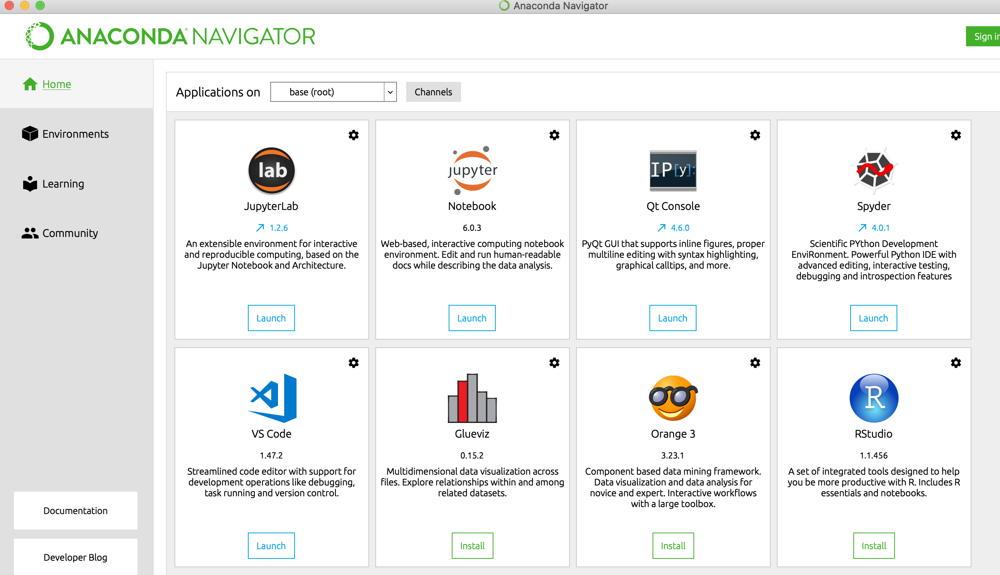
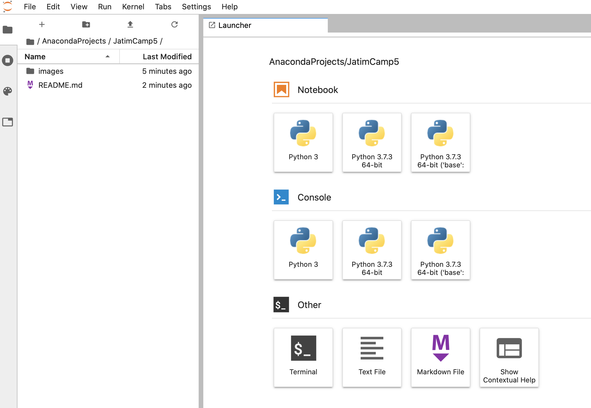

## JatimCamp 5 - Introduction To Data Engineer

<!-- PROJECT SHIELDS -->
<!--
Thank you for https://github.com/othneildrew/Best-README-Template/blob/master/README.md giving me an idea for build this readme
*** I'm using markdown "reference style" links for readability.
*** Reference links are enclosed in brackets [ ] instead of parentheses ( ).
*** See the bottom of this document for the declaration of the reference variables
*** for contributors-url, forks-url, etc. This is an optional, concise syntax you may use.
*** https://www.markdownguide.org/basic-syntax/#reference-style-links
-->

<!-- TABLE OF CONTENTS -->
### Table of Contents
* [Built With](#built-with)
* [Prerequisites](#prerequisites)
* [Application](#application)
* [Contact](#contact)

### Built With
* [Python](https://python.org)
* [Mysql](https://mysql.com)

### Prerequisites

* Anaconda
Download [Anaconda](https://anaconda.com/download) and choose the version based on system operation

### Application

- After downloading and installing anaconda, open on your menu and choose **anaconda-navigator**, looks like this

- Click launch on jupyter lab and should launch a window looks like this

 - Click python 3 on notebook menu and we start coding

<!-- CONTACT -->
## Contact

[@adamwdb](https://twitter.com/adamwdb)

Project Link: [https://github.com/adamwidi/JatimCamp5](https://github.com/adamwidi/JatimCamp5)